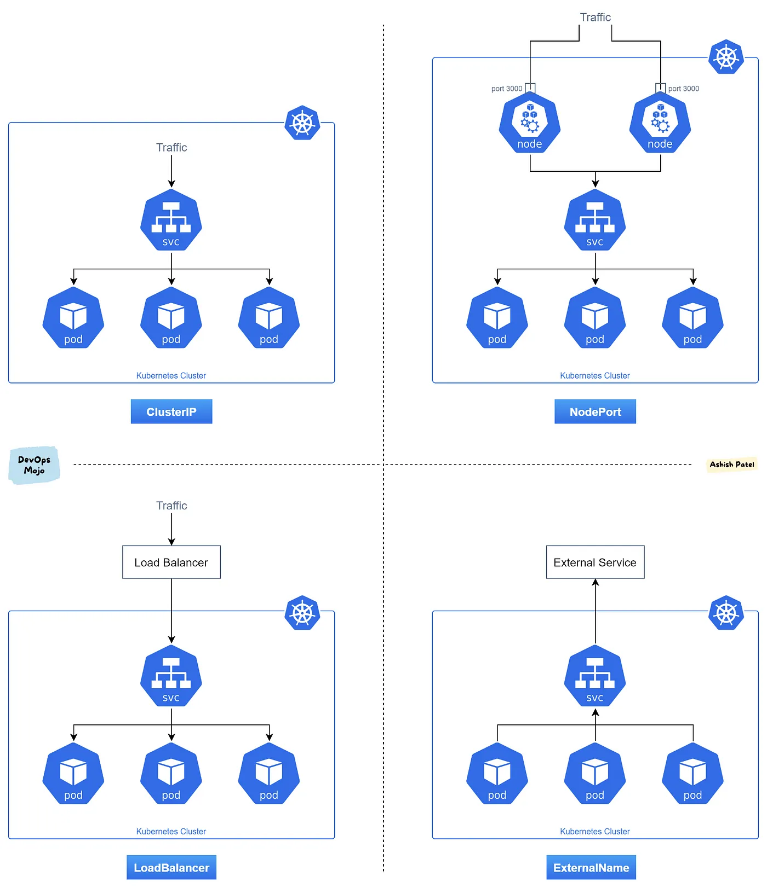
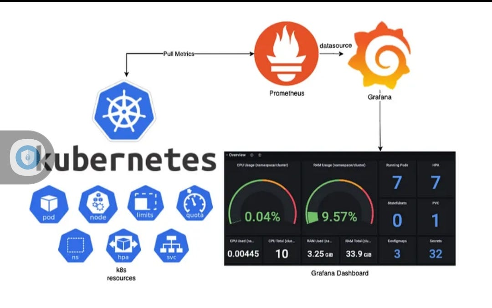
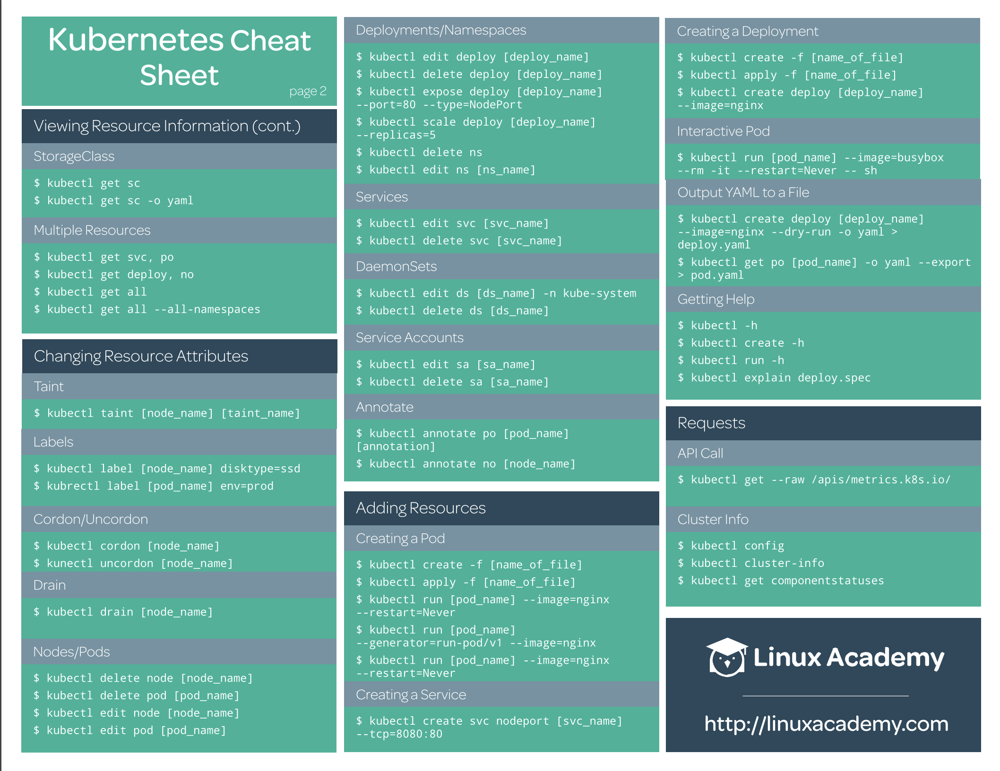

# Kubernetes - Cubernetes 

## [Roadmap](kubernetes.pdf)

## [Setup your first Kubernetes cluster with Kind](https://kind.sigs.k8s.io/docs/user/quick-start/#installation)
   ### 
 

## [Architecture](https://kubernetes.io/docs/concepts/architecture/)
   ### 
   ### Control plane components: Understand the role of each component like API server, etcd, Scheduler, and Controller manager.
   ### Node components: Learn about Kube Proxy, Kubelet, Container Runtime
   ### Addon Components: CoreDNS, Network plugins (Calico, weave, etc), Metric Server
 
   

## [Organizing Cluster Access Using kubeconfig Files](https://kubernetes.io/docs/concepts/configuration/organize-cluster-access-kubeconfig/)
   ### 
   ### Kubeconfig file is a YAML file that contains all the cluster information and credentials to connect to the cluster.
 

## [Namespaces](https://kubernetes.io/docs/concepts/overview/working-with-objects/namespaces/)
   ### 
   ### Namespaces are a way to organize clusters into virtual sub-clusters — they can be helpful when different teams or projects share a Kubernetes cluster. 
 

## [RBAC]()
   ### 
   ### RBAC is a model designed to grant access to resources based on the roles of individual users within an organization.
    

## Workload objects
   ### 
 

## Service & load balancing
   ### 
   ### Since pods are ephemeral, a service enables a group of pods, which provide specific functions (web services, image processing, etc.) to be assigned a name and unique IP address (clusterIP). As long as the service is running that IP address, it will not change. Services also define policies for their access.
 
   
## Configmap & secrets
   ### 
 

## Volumes
   ### 
 
   
## Scaling your app
 

## Updating K8S application
 

## Debugging application
 

## Monitoring & Logging
   ### 
 

## Kubernetes cheatsheet
   ### 
   ### 
   
